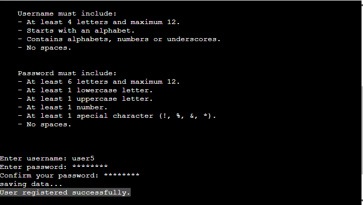

# Number Ninja
Number Ninja is an arithmetic operator game. 

View the live site [here](https://number-ninja-3ab6f688eeb0.herokuapp.com/).

# Table of Contents

1. [Project Goals](#project-goals)
    1. [User Goals](#user-goals)
    2. [Site Owner Goals](#site-owner-goals)
2. [User Experience](#user-experience)
    1. [Target Audience](#target-audience)
    2. [User Requirements and Expectations](#user-requirements-and-expectations)
    3. [User Stories](#user-stories)
3. [Program FlowChart](#program-flowchart)
4. [Features](#features)
5. [Technologies Used](#technologies-used)
    1. [Languages](#languages)
    2. [Frameworks](#frameworkslibraries-programmes-and-tools)
6. [Testing](#testing)
7. [Development Bugs](#development-bugs)
8. [Deployment](#deployment-and-development)
9. [Credits](#credits)
10. [Acknowledgements](#acknowledgements)

## Project Goals

### User Goals
- Allow user to signup and login
- User should be able to login from diffrent machines.
- Play arithmatic opertors game with addition, subtraction, multiplication and division are supported.
- Levels easy, medium and hard are supported
- User should be able to see the score.

### Site Owner Goals
- Simple arithmatic command line application
- Provide 10 arithmatic games for user selected level and operator
- Save the highest scrore for each level in the data storage

## User Experience

### Target Audience
- People who wants to imrove the arithmatic operator
- People who want to create profile and play arithmatic operators from different machines
- People who want to track the progress

### User Requirements and Expectations
- Easy to use and easy to understand
- Should be able to see score for every level and arithmatic operators
- Authorization is required to start the game and see the score.

### User Stories
As I user I want to:
1. Create user profile using signup
2. Login using the username and password provided during signup
3. Select the level for the game
4. Select the arithmatic operation that I want to play - adddition, subtraction, multiplication or division
5. See score after each operation game
6. See overall scrore for all levels and operations
7. Way to go to back layer above from every layer

As I owner I want to:
1. Give correct instructions for creating user name and password
2. Give user maximum three attempts for invalid credentials during login
3. Show two random numbers between 0 and 9 for easy level
4. Show two random numbers between 0 and 99 for medium level
5. Show two random numbers between 0 and 9999 for hard level
6. Show maximum 10 questions for the selected level and arithmatic operation.

## Program Flowchart

### Data Storage
The data for the application including user name, password and scrore for every level are stored in a google sheet. You can view the sheet [here](https://docs.google.com/spreadsheets/d/1NEJbjlGX71COJ888ChN1LYDYgf0Q3zYNLa0SJBLC1AY/edit?usp=sharing)

## Features
### Welcome Message
- Shows welcome screen along with main menu

### Main Menu
- The user is able to select the options Login or SignUp
- Select 1 for Login and 2 for Signup or 3 to show the instructions menu

### Login Menu
- User is prompted to enter user name and password to autheticate
- Password entered is shown as '*'
- Username or password does not match the value in the data storage, error message will be shown to the user
- If username or password does not mach the value in the data storage, user will be prompted to again three times

### Sign up menu
- User is prompted to enter username and password to create new profile
- If user name already exists, error message will be shown
- If user name or password does not meet the criteria, error message will be shown

### Instructions menu
- Shows the instructions to how to use game and rules
- Press 'Enter' key to return to main menu.

### User options menu
- The user options is displayed when user login succesfully.
- This presents user with options for:
    - Number game, which allows user to start the game
    - Shows score, which allows user to show score for all operators and levels
    - Quit, which allows user to quit user option menu and back to main menu

### Number Game
#### Level Menu
- The Level menu is disaplayed when user selects number game options from user options menu
- This presents user with options for:
    - Level Easy, where number ranges from 0 to 9
    - Level Medium, where number ranges from 0 to 99
    - Level Hard, where mumber ranges from 0 to 9999
    - Quit, where user can exit from level menu to user options menu

#### Arithmatic Operator Menu
- The arithmatic operator menu is disaplayed once user selected the level for the game as either easy or medium or hard
- This presents user with options for:
    - Addition, where user will be presented with two numbers to add
    - Subtration, where user will be presented with two numbers to subtract
    - Multiplication, where user will be presented with two numbers to multiply
    - Division, where user will be presented with two numbers to divide
    - Quit, where user can exit to user options menu

#### Game start Menu
- Game start menu is disaplyed once user selected operator as either addition, subtraction, multiplcation or division
- This will present user questions with random number for the range selected by the user.
- Once user entered the answer, correcteness of the anwer will be displayed.
- User will be presented with 10 questions
- For division interger part of quotient is considered as correct answer. For example, for the question 9/2, correct answer is 4.
- Overall score of the game will be displayed after anwering all 10 questions.

### Show Score Menu
- This menu will be presented when user selects show score option from user options menu
- This presents user highest score for every level and every operator in a tabular form

### Feedback for invalid user name for sign up
- If user name entered is not valid, user will be presented with invalid username menu

### Feedback for invalid password for sign up
- If password entered is not valid, user will be presented with invalid password menu

### Feedback for invalid credentials for login
- If username or password does not match, user will be presented with invalid credentials menu.
- User will be presented 3 times to retry.
- User can choose whether they want to retry or not. 
- User will be presented with invalid crentials message and timeout for 2 seconds before showing the retry screen

## Technologies Used

### Languages:

- [Python 3.8.5](https://www.python.org/downloads/release/python-385/): used to anchor the project and direct all application behavior

- [JavaScript](https://www.javascript.com/): used to provide the start script needed to run the Code Institute mock terminal in the browser

- [HTML](https://developer.mozilla.org/en-US/docs/Web/HTML) used to construct the elements involved in building the mock terminal in the browser

### Frameworks/Libraries, Programmes and Tools:
#### Python modules/packages:

##### Standard library imports:

- [random](https://docs.python.org/3/library/random.html) was used to implement pseudo-random number generation.
- [os](https://docs.python.org/3/library/os.html ) was used to clear the terminal before running the program.
- [time](https://docs.python.org/3/library/time.html ) was used to sleep after showing error messages in the program.
- [re](https://docs.python.org/3/library/re.html ) was used match username and password using regular expression.
- [base64](https://docs.python.org/3/library/base64.html ) was used for encrypting password before saving to data store

##### Third-party imports:
- [Colorama](https://pypi.org/project/colorama/) was used to add colors and styles to the project.
- [GSpread](https://pypi.org/project/gspread/) Used to manipulate data in google sheets.
- [Tabulate](https://pypi.org/project/tabulate/) Used to present data in a table format.
- [pwinput](https://pypi.org/project/pwinput/) Used to show password input as *
- [pyfiglet](https://pypi.org/project/pyfiglet/) Used to show the welcome screen ASCII art fonts

#### Other tools:
- [VSCode](https://code.visualstudio.com/) was used as the main tool to write and edit code.
- [Git](https://git-scm.com/) was used for the version control of the website.
- [GitHub](https://github.com/) was used to host the code of the website.
- [Draw.io](https://www.lucidchart.com/) was used to make a flowchart for the README file.
- HTML provided in the Code Institute template
- CSS provided in the Code Institute template
- JavaScript provided in the Code Institute template
- [Google Sheets](https://www.google.co.uk/sheets/about/) Used to host application data
- [Heroku](https://id.heroku.com/login) Used to deploy the project

## Testing
### Python PEP8 Validation
Passed the code through a PEP8 linter and confirmed there are now no issues at the time of this test

### Testing user stories
1. Create user profile using signup

|Feature|Action|Expected result|Actual result|
|---|---|---|---|
User profile|Click 'Run Program' and select 'Sign Up' option by entering '2' from main menu. Enter valid user name and password  |User profile is created and "User registered successfully." is visible |Works as expected|

2. Login using the username and password provided during signup

|Feature|Action|Expected result|Actual result|
|---|---|---|---|
Login|Click 'Run Program' and select 'Login' option by entering '1' from main menu. Enter user name and password |Login is succesful and "User Options" menu is visible |Works as expected|

3. Select the level for the game

|Feature|Action|Expected result|Actual result|
|---|---|---|---|
Game level|After login, from 'User Options' menu select 'Start Number Game' by entering '1'. From the 'Game Level' menu select required level by entering '1' for easy, '2' for medium or '3' for hard|Level menu is visible and required level can be selected. 'Arithmatic Operator' menu is visible after entering '1' or '2' or '3' |Works as expected|

4. Select the arithmatic operation that I want to play

|Feature|Action|Expected result|Actual result|
|---|---|---|---|
Operation selection|After selecting the game level, from 'Arithmatic Operator' menu select 'Addition' by entering '1' or 'Subtraction' by entering '2' or 'Multiplication' by entering '3' or 'Division' by entering '4'|Arithmatic operator menu is visible and required option can be selected. Once selected, question is visible for the required level and operator |Works as expected|

5. See score after each operation game

|Feature|Action|Expected result|Actual result|
|---|---|---|---|
Game result|After selecting the game level and arithmatic operator, user will presented with questions. Enter answer for all questions. |Overall score for the game along with highest score for the level and operator shall be visible. |Works as expected|

6. See overall scrore for all levels and operations

|Feature|Action|Expected result|Actual result|
|---|---|---|---|
Shows the overall score for the user|From 'User options' menu, select 'Show Your Score' option by entering '2'.| Overall score for all levels and operators is visible in a tabular form |Works as expected|

5. Way to go to back layer above from every layer

|Feature|Action|Expected result|Actual result|
|---|---|---|---|
Way to go back to previous level of the game| From any level select 'Quit' option by entering corresponding number| Parent menu is visible |Works as expected|

### As an owner I want the user to
1. Give correct instructions for creating user name and password

|Feature|Action|Expected result|Actual result|
|---|---|---|---|
Password and Username policy|From main menu, select signup option by entering '2'  |Username and password policy is shown to user |Works as expected|

2. Give user maximum three attempts for invalid credentials during login

|Feature|Action|Expected result|Actual result|
|---|---|---|---|
Limit attempts for invalid login|From main menu, select login option by entering '1'. Enter invalid user name or password. |Invalid user name or password message is visible and user is presented menu to retry maximum three times |Works as expected|

2. Show two random numbers between 0 and 9 for easy level

|Feature|Action|Expected result|Actual result|
|---|---|---|---|
Number range for level easy|From 'Level Menu' select level as 'easy'. From 'Arithmatic Operator' menu select 'Addition' or 'Subtraction' or 'Multiplication' or 'Division' as operator. |Numbers presented to user is within range 0 to 9. |Works as expected|

3. Show two random numbers between 0 and 99 for medium level

|Feature|Action|Expected result|Actual result|
|---|---|---|---|
Number range for level medium|From 'Level Menu' select level as 'medium'. From 'Arithmatic Operator' menu select 'Addition' or 'Subtraction' or 'Multiplication' or 'Division' as operator. |Numbers presented to user is within range 0 to 99. |Works as expected|

4. Show two random numbers between 0 and 99 for medium level

|Feature|Action|Expected result|Actual result|
|---|---|---|---|
Number range for level medium|From 'Level Menu' select level as 'medium'. From 'Arithmatic Operator' menu select 'Addition' or 'Subtraction' or 'Multiplication' or 'Division' as operator. |Numbers presented to user is within range 0 to 99. |Works as expected|

5. Show two random numbers between 0 and 9999 for hard level

|Feature|Action|Expected result|Actual result|
|---|---|---|---|
Number range for level hard|From 'Level Menu' select level as 'hard'. From 'Arithmatic Operator' menu select 'Addition' or 'Subtraction' or 'Multiplication' or 'Division' as operator. |Numbers presented to user is within range 0 to 9999. |Works as expected|

6. Show maximum 10 questions for the selected level and arithmatic operation.

|Feature|Action|Expected result|Actual result|
|---|---|---|---|
Limit number of question|From 'Level Menu' select required level. From 'Arithmatic Operator' menu select 'Addition' or 'Subtraction' or 'Multiplication' or 'Division' as operator. Enter answeres for every questions presented|Maximum 10 questions are presented to user |Works as expected|

## Development Bugs

During development, manual testing was carried out for each feature. A few problems were found and resolved.
The problems encountered during development are shown below.
- Clear screen was not working  at every level
    - Clear screen was missing at some edge cases
- Password was written as plain text in data storage
    - Added encryption to password
- Color was reset at some places
    - Added function color_print and reset color in order to avoid issues.

## Deployment and Development

* The project files, code, and information are hosted by [Github](https://github.com/).

### Deploying the App

The deployment of the project was done using [Heroku](https://www.heroku.com/) through the following steps.

1. Log in to Heroku or create an account if necessary.
2. Click on the button labeled "New" from the dashboard in the top right corner and select the "Create new app" option in the drop-down menu.
3. Enter a unique name for the application and select the region you are in.
   * For this project, the unique name is "number-ninja" and the region selected is Europe.
4. Click on "create app".
5. Navigate to the settings tab and locate the "Config Vars" section and click "Reveal config vars".
6. Add CREDS config var
   * In the "KEY" field:
      * enter "CREDS" in capital letters.
   * In the "VALUE" field:
      * copy and paste the contents of your creds.json file and click "Add".
7. Add another config var 'PORT' if required.
   * In the "KEY" field:
      * enter PORT in all capital letters.
   * In the "VALUE" field:
      * enter 8000 and click "Add".
8. Add another config var 'Encryption_key'
   * In the "KEY" field:
      * enter Encryption_key in all capital letters.
   * In the "VALUE" field:
      * enter string value and click "Add". This is used as key for password encryption
9. Scroll to the "Buildpacks" section and click "Add buildpack".
10. Select Python and save changes.
11. Add another buildpack and select Nodejs then save changes again.
12. Ensure that the python buildpack is above the Nodejs buildpack.
13. Navigate to the "Deploy" section by clicking the "Deploy" tab in the top navbar.
14. Select "GitHub" as the deployment method and click "Connect to GitHub".
15. Search for the GitHub repository name in the search bar.
16. Click on "connect" to link the repository to Heroku.
17. Scroll down and click on "Deploy Branch".
18. Once the app is deployed, Heroku will notify you and provide a button to view the app.

NB - If you wish to rebuild the deployed app automatically every time you push to GitHub, you may click on "Enable Automatic Deploys".

### Forking The Repository

This can be done to create a copy of the repository. The copy can be viewed and edited without affecting the original repository.

To fork the repository through GitHub, take the following steps:
1. In the "number-ninja" repository, click on the "fork" tab in the top right corner.
2. Click on "create fork" to fork the repository.

### Cloning The Repository

To clone the repository through GitHub:

1. In the repository, select the "code" tab.
2. Ensure HTTPS is selected in the dropdown menu.
3. Copy the URL under HTTPS.
4. Open Git Bash in your IDE of choice.
5. Change the current working directory to the location where you want the cloned directory to be created.
6. Type "git clone" and paste the URL that was copied from the repository.
7. Press the "enter" key to create the clone.

### APIs 
In order for the app to function properly, APIs need to be set up and connected. In particular, the following APIs were used for this project:

* Google Drive API.
   * This helps with getting credentials to access the files within google drive.
* Google Sheets API.
   * This is the API for the google sheets where the data is stored for the program.

I followed the steps in a video from the [Code Institute](https://codeinstitute.net/global/) Love Sandwiches project on how to set up and connect APIs. The link to this video is [here](https://www.youtube.com/watch?v=WTll5p4N7hE).

## Credits

* I used [this video](https://www.youtube.com/watch?v=WTll5p4N7hE) from [Code Institute](https://codeinstitute.net/global/) to learn how to create and link APIs.

## Acknowledgements

This site was developed as a third portfolio project for the Code Institute course in Full Stack Software Development. I would like to thank the following for all of the support throughout the development phase.

- [Iuliia Konovalova](https://github.com/IuliiaKonovalova) was a great supporter of another bold idea of mine for this project. Iuliia guided me through the development of the project and helped me to learn a lot of new things by challenging me to do something new.
- [Code Institute](https://codeinstitute.net/) tutors and Slack community members for their support and help.
