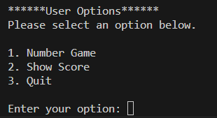
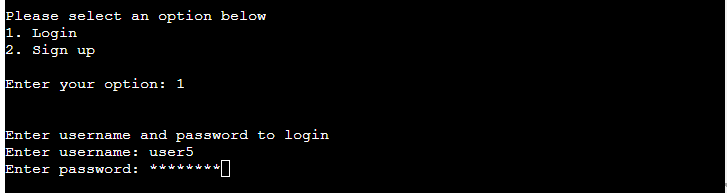

# Number Ninja
Number Ninja is an arithmetic operator game

View the live site [here](https://number-ninja-3ab6f688eeb0.herokuapp.com/).

## Project Goals

### User Goals
- Allow user to sigup and login
- User should be able to login from diffrent machines.
- Play arithmatic opertors gmae with addition, subtraction, multiplication and division are supported.
- Levels easy, medium and hard are supported
- User should be able to see the score.

### Site Owner Goals
- Simple arithmatic command line application
- Provide 10 arithmatic games for user selected level and operator
- Save the highest scrore for each level in the data storage

## User Experience

### Target Audience
- People who wants to imrove the arithmatic operator
- People who want to create profile and play arithmatic operators from different machines
- People who want to track the progress

### User Requirements and Expectations
- Easy to use and easy to understand
- Should be able to see score for every level and arithmatic operators
- Authorization is required to start the game and see the score.

### User Stories
As I user I want to:
1. Create user profile using signup
2. Login using the username and password provided during signup
3. Select the level for the game
4. Select the arithmatic operation that I want to play - adddition, subtraction, multiplication or division
5. See score after each operation game
6. See overall scrore for all levels and operations
7. Way to go to back layer above from every layer

As I owner I want to:
1. Ensure strong password is used for signup
2. Give correct instructions for creating user name and password
3. Give correct error message if user name or password does not meet the requirment
4. Give user maximum three attempts for invalid credentials during login
5. Show two random numbers between 0 and 9 for easy level
6. Show two random numbers between 0 and 99 for medium level
7. Show two random numbers between 0 and 9999 for hard level
8. Show maximum 10 questions for the selected level and arithmatic operation.

### Program Flowchart

### Data Storage
The data for the application including user name, password and scrore for every level are stored in a google sheet. You can view the sheet [here](https://docs.google.com/spreadsheets/d/1NEJbjlGX71COJ888ChN1LYDYgf0Q3zYNLa0SJBLC1AY/edit?usp=sharing)

### Features
#### Welcome Message
<TODO>

#### Main Menu
- The user is able to select the options Login or SignUp
- Select 1 for Login and 2 for Signup   

#### Login Menu
- User is prompted to enter user name and password to autheticate
- Password entered is shown as '*'
- Username or password does not match the value in the data storage, error message will be shown to the user
- If username or password does not mach the value in the data storage, user will be prompted to again three times   

#### Sign up menu
- User is prompted to enter username and password to create new profile
- If user name already exists, error message will be shown
- If user name or password does not meet the criteria, error message will be shown   

#### User options menu
- The user options is displayed when user login succesfully.
- This presets user with options for:
    - Number game, which allows user to start the game
    - Shows score, which allows user to show score for all operators and levels
    - Quit, which allows user to quit user option menu and back to main menu   

#### Number Game
##### Level Menu
- The Level menu is disaplayed when user selects number game options from user options menu
- This presets user with options for:
    - Level Easy, where number ranges from 0 to 9
    - Level Medium, where number ranges from 0 to 99
    - Level Hard, where mumber ranges from 0 to 9999
    - Quit, where user can exit from level menu to user options menu   

##### Arithmatic Operator Menu
- The arithmatic operator menu is disaplayed once user selected the level for the game as either easy or medium or hard
- This presets user with options for:
    - Addition, where user will be preseted with two numbers to add
    - Subtration, where user will be preseted with two numbers to subtract 
    - Multiplication, where user will be preseted with two numbers to multiply
    - Division, where user will be preseted with two numbers to divide
    - Quit, where user can exit to user options menu   

##### Game start Menu
- Game start menu is disaplyed once user selected operator as wither addition, subtraction, multiplcation or division
- This will prset user questions with random number for the range selected by the user.
- Once user entered the answer, correcteness of the anwer will be displayed.
- User will be preseted with 10 questions
- Overall score of the game will be displayed after anwering all 10 questions.   

#### Show Score Menu
- This menu will be preseted when user selects show score option from user options menu
- This presets user highest score for every level and every operator in a tabular form   

#### Feedback for invalid user name for sign up
- If user name entered is not valid, user will be preseted with invalid username menu   

#### Feedback for invalid password for sign up
- If password entered is not valid, user will be preseted with invalid password menu   

#### Feedback for invalid credentials for login
- If username or password does not match, user will be

### Technologies Used
- [draw.IO](https://app.diagrams.net/)
- HTML provided in the Code Institute template
- CSS provided in the Code Institute template
- JavaScript provided in the Code Institute template
- [Google Sheets](https://www.google.co.uk/sheets/about/) Used to host application data
- [Github](https://github.com/) Used to host the repository
- [Heroku](https://id.heroku.com/login) Used to deploy the project

### Python libraries used
- [GSpread](https://pypi.org/project/gspread/) Used to manipulate data in google sheets.
- [Tabulate](https://pypi.org/project/tabulate/) Used to present data in a table format.
- [pwinput](https://pypi.org/project/pwinput/) Used to show password input as *

### Testing
#### Python PEP8 Validation
Passed the code through a PEP8 linter and confirmed there are now no issues at the time of this test

#### Testing user stories
1. Create user profile using signup

|Feature|Action|Expected result|Actual result|
|---|---|---|---|
User profile|Click 'Run Program' and select 'Sign Up' option by entering '2' from main menu. Enter valid user name and password  |User profile is created and "User registered successfully." is visible |Works as expected|

2. Login using the username and password provided during signup

|Feature|Action|Expected result|Actual result|
|---|---|---|---|
Login|Click 'Run Program' and select 'Login' option by entering '1' from main menu. Enter user name and password |Login is succesful and "User Options" menu is visible |Works as expected|

3. Select the level for the game

|Feature|Action|Expected result|Actual result|
|---|---|---|---|
Game level|After login, from 'User Options' menu select 'Start Number Game' by entering '1'. From the 'Game Level' menu select required level by entering '1' for easy, '2' for medium or '3' for hard|Level menu is visible and required level can be selected. 'Arithmatic Operator' menu is visible after entering '1' or '2' or '3' |Works as expected|

4. Select the arithmatic operation that I want to play

|Feature|Action|Expected result|Actual result|
|---|---|---|---|
Operation selection|After selecting the game level, from 'Arithmatic Operator' menu select 'Addition' by entering '1' or 'Subtraction' by entering '2' or 'Multiplication' by entering '3' or 'Division' by entering '4'|Arithmatic operator menu is visible and required option can be selected. Once selected, question is visible for the required level and operator |Works as expected|

#### As an owner I want the user to
